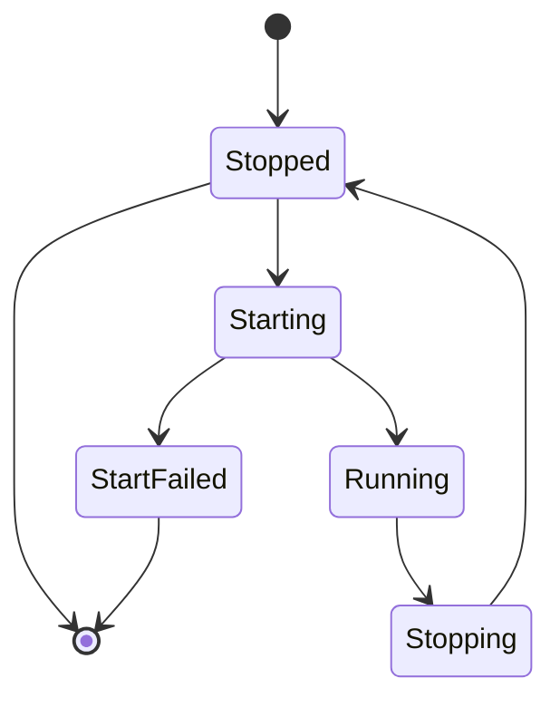
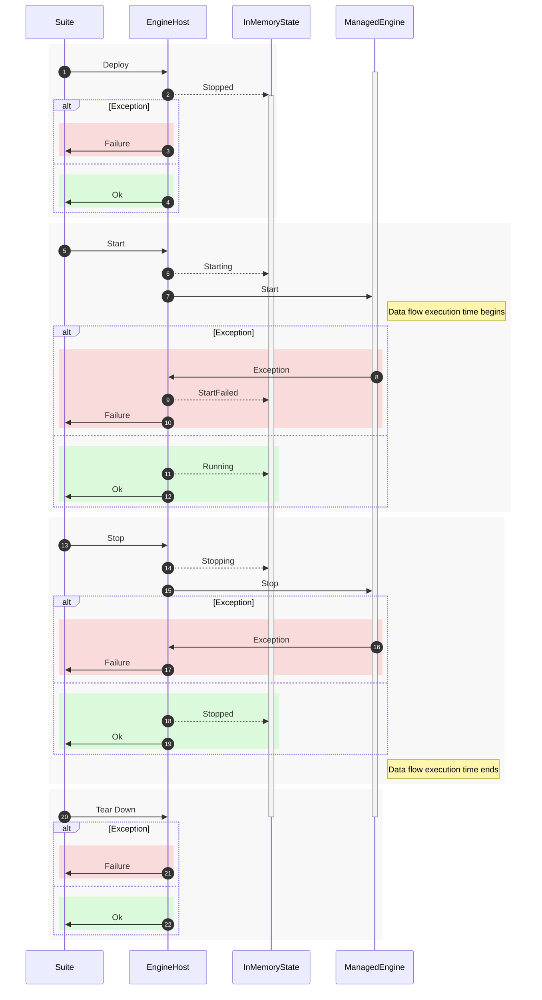

# Engine Host

Engine Host is the runtime hosting service of the [ViciOne](https://gitlab.com/vicione-oss) platform. It acts as the deployment container and lifecycle orchestrator for **ManagedEngines** — isolated, dynamically loaded data flow processors composed of interconnected FunctionBlocks.

In industrial and IoT environments, data must be continuously collected, transformed, and forwarded — often across hybrid cloud and on-premise setups. Engine Host addresses this by allowing data flows to be deployed, started, stopped, and torn down remotely via MQTT, without recompilation or redeployment of the host itself. Multiple engines can run concurrently, all synchronized to a single shared cycle time through the EngineChain — a coordinated execution loop that processes every enabled engine in index order on each tick, using high-resolution timers for drift-free timing.

Engines are assembled from reusable packages (FunctionBlocks, communicators, type converters, etc.) resolved at deploy time from NuGet feeds, local directories, or through a build using the .NET SDK. Each engine is loaded into an assembly context that can be isolated or shared across engines to optimize memory usage. External data exchange — with sensors, other engines, or cloud services — is handled through pluggable connectors (MQTT, Direct), while settings and variable state can be persisted across restarts.

Observability is provided through OpenTelemetry (tracing and metrics) in development environments, and Serilog structured logging in production, giving operators visibility into cycle performance, engine state, and failures.

## Configuration

### OpenTelemetry

OpenTelemetry configuration is done via environment variables, see [OpenTelemetry Documentation](https://opentelemetry.io/docs/specs/otel/configuration/sdk-environment-variables/).

Additional configuration of activities and meters with the following properties:

- `OTEL_ADDITIONAL_SOURCES` (string[])
- `OTEL_ADDITIONAL_METERS` (string[])

Example:

```json
{
  "OTEL_EXPORTER_OTLP_ENDPOINT": "http://localhost:4317",
  "OTEL_ADDITIONAL_METERS": [
    "Meter.Sample1",
    "Meter.Sample2"
  ],
  "OTEL_ADDITIONAL_SOURCES__0": "Source.Sample1",
  "OTEL_ADDITIONAL_SOURCES__1": "Source.Sample2"
}
```

## Commands

| | |
| --- | --- |
| **Request-Topic** | {HostId}/request |
| **Response-Topic** | Message Response Topic |

All payloads are expected as JSON. The exception is the exception for status [failed](#response-status). Possible *ContentType*s are `application/json` and `application/gzip`.

The example text `Hello World` must be transferred in the payload as a string encoded as JSON (`application/json`): `"Hello World"`

### Request Message

- User-Property *Method*
- Correlation Data
- Response Topic

### Response Message

- User-Property *Status*
- Correlation Data

### Methods

| Method | Request Payload Type | Response Payload Type |
| --- | --- | --- |
| Deploy | [DeployEnginePayload](src/EngineHost/Communication/DeployEnginePayload.cs) | string |
| Start | string | bool |
| Stop | string | bool |
| TearDown | string | - |
| GetState | string | [EngineState](https://gitlab.com/vicione-oss/vicione/runtime/managed-engine/-/blob/master/src/ManagedEngine.Contracts/EngineState.cs) |
| GetDeploymentStates | - | IReadOnlyDictionary<string, [EngineState](https://gitlab.com/vicione-oss/vicione/runtime/managed-engine/-/blob/master/src/ManagedEngine.Contracts/EngineState.cs)> |
| GetPackages | string | IReadOnlyList<[PackageReference](src/PackageResolvers/PackageReference.cs)> |

### Response Status

| Status | Payload Type | ContentType |
| - | - | - |
| ok | &lt;Response Payload Type of Method&gt; | &lt;Request *ContentType*&gt; |
| failed | string (Exception) | `text/plain` |

## Engine States

The state of an engine can be queried. The state is not reported since no one depends on the state.

| Status | Meaning | Origin | Startable | Stoppable | Teardownable |
| --- | --- | --- | --- | --- | --- |
| Stopped | The data flow is not being executed. | Engine | ✔ | ✖ Already stopped | ✔ |
| Starting | The data flow is being started. | Engine | ✖ Already started | ✔ | ✖ |
| StartFailed | An error occurred when starting the data flow despite valid parameters, e.g. semantically incorrect parameters. Errors are in the log. | Engine | ✔ Configuration may now be correct | ✖ Already stopped | ✔ |
| Running | The data flow is being executed. | Engine | ✖ Already running | ✔ | ✖ |
| Stopping | The data flow is being stopped. | Engine | ✖ Still running | ✖ Stop may still succeed or engine is hanging | ✖ |

### Transitions



### Flow



## CI overview

|  Stage  | Job                           |    Tag    | Default branch | Merge request |    Web    |
|:-------:|-------------------------------|:---------:|:--------------:|:-------------:|:---------:|
|   .pre  | **Get version**               |    run    |       run      |      run      |    run    |
|   .pre  | **Restore**                   |    run    |       run      |      run      |    run    |
|  build  | **Build**                     |    run    |    not added   |   not added   | not added |
|   test  | **Build+Test**                | not added |       run      |      run      |    run    |
|   test  | **Lint Markdown**             | not added |       run      |      run      |    run    |
|   pack  | **Pack NuGet**                |    run    |     manual     |     manual    |   manual  |
| publish | **Publish NuGet**             |   manual  |     manual     |     manual    |   manual  |
| publish | **Prerelease EngineHost Raw** | not added |     manual     |     manual    |   manual  |
| publish | **Release EngineHost Raw**    |    run    |    not added   |   not added   | not added |
| publish | **Publish EngineHost Raw**    |   manual  |    not added   |   not added   | not added |
